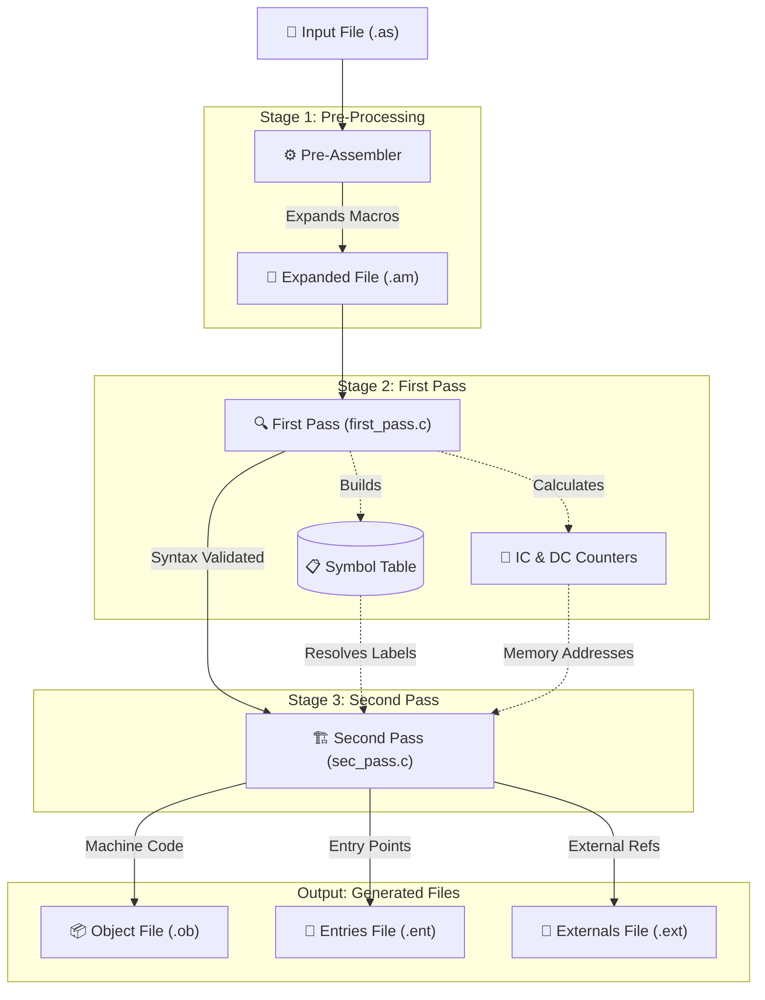

[](https://github.com/RonB8/Assembler/actions/workflows/build.yml)

# 14-Bit Assembler Simulator

This project is a simulation of an Assembler. It processes assembly language source files, handles macro expansions, and converts the code into a unique 14-bit machine language representation.

## Features
- **Pre-Assembler**: Handles macro expansion (`mcr` ... `endmcr`).
- **Two-Pass Analysis**: Performs a first pass to build symbol tables and a second pass for final encoding.
- **Custom Encoding**: Outputs machine code in a unique base-2 format where `0` is represented by `.` and `1` is represented by `/`.
- **Support for Entries and Externals**: Generates dedicated files for `.entry` and `.extern` labels.

## Workflow


## Prerequisites
- **Compiler**: `gcc`
- **Operating System**: Linux / Unix-based system (for `make` and `.out` execution).

## Installation and Compilation
1. Open your terminal in the project directory.
2. Compile the project using the provided `makefile` by typing:
   ```bash
   make

```

This will generate the executable file `assembler.out`.

## Usage

To run the assembler, provide the name of your assembly source file(s) **without** the `.as` extension. The program automatically appends the extension during processing.

```bash
./assembler.out <filename1> <filename2> ...

```

**Example:**
If you have a source file named `example.as`, run:

```bash
./assembler.out example

```

## Output Files

For every input file (e.g., `filename.as`), the assembler generates the following:

1. **`filename.am`**: The source file after macro expansion (Pre-Assembler stage).
2. **`filename.ob`**: The object file containing the 14-bit memory addresses and their encoded instructions (using `.` and `/`).
3. **`filename.ent`**: A table of labels defined as `.entry` and their corresponding addresses.
4. **`filename.ext`**: A table of labels defined as `.extern` and the addresses where they are referenced.

## Technical Specifications

* **Registers**: 8 CPU registers (r0-r7), each 14 bits wide.
* **Memory**: 256 memory cells, each 14 bits wide.
* **Addressing**: Instructions are mapped to memory addresses between 100-255.
* **Method**: Supports positive and negative numbers using the 2's complement method.

## Cleaning Up

To remove the compiled object files and the executable, run:

```bash
make clean

```
